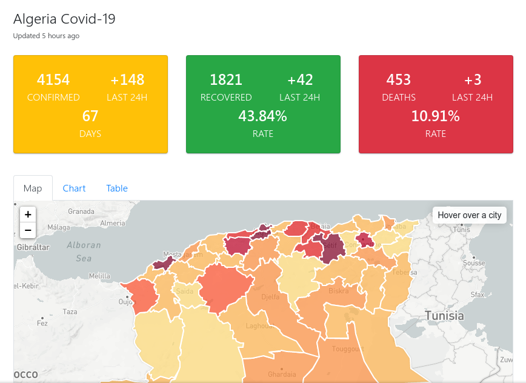

# Algeria Covid-19

A community powered COVID-19 coronavirus tracker for Algeria.

The project is a single page JavaScript application running in the browser, pulling data in via a JSON like file.

[Check it](https://corona-dz.live)

## Screenshot

## Data Sources

For all information regarding the data powering this site, please visit [data](https://github.com/Amine27/covid-19-dz/blob/master/js/data.js) file.

Our data is sourced primarily from the Algerian Ministry of Health, Population and Hospital Reform ([MSPRH](http://covid19.sante.gov.dz/)).

## Contributing Code

If you would like to contribute features, refactor code, etc., please create or comment on an issue on this repo.

## Running Dev Locally

Simply, open index.html in your web browser.

## License & Code Re-use

The code for this project is released under the [MIT License](LICENSE). You are free to re-use it but we ask that you please include a link back to the [COVID-19 Algeria website](https://corona-dz.live) or [this GitHub repository](https://github.com/Amine27/covid-19-dz). We'd also be happy to include your site in the list of forked projects – just create an issue to request it.

## Core Contributors

- [Amine Roukh](https://www.linkedin.com/in/amineroukh/)
